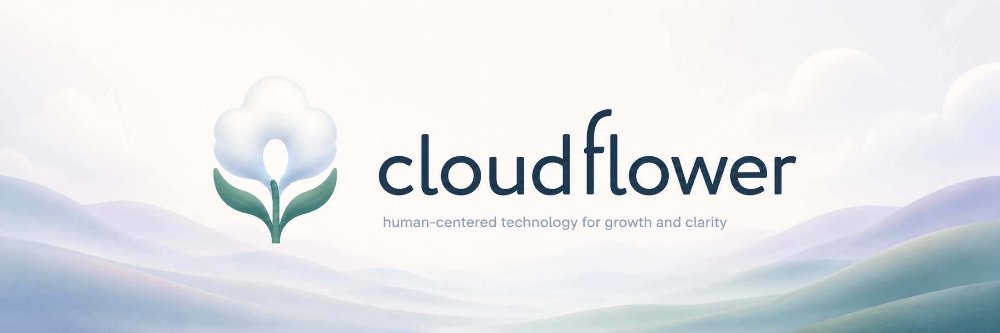

  

<h1 align="center">Personal AI OS</h1>

  A local-first personal growth operating system for context, projects, memory, and long-term self-development.

  <strong>Private development by thecloudflower.</strong>

---

## Current status

**Personal AI OS** is currently in private development.

The active source code, internal documentation, development history, assistant memory, and vault materials are not public at this time.

This repository is a public landing page only.

## What PAO explores

PAO is being designed as a structured environment where personal context, notes, projects, assistants, and long-term self-development can stay organized over time.

The project explores:

- local-first personal knowledge management
- AI-assisted project continuity
- structured memory and context handoff
- versioned personal operating workflows
- human-approved automation
- long-term personal growth infrastructure

## Development philosophy

PAO is built around a simple principle:

> Personal systems should adapt as the person grows.

The goal is not to replace human judgment, but to support it with clearer context, safer workflows, and better continuity across time.

## Public materials

This public repository does **not** contain:

- PAO source code
- private vault files
- internal assistant memory
- development releases
- personal context
- AI assistant working files

Those materials remain private.

## Built by

**thecloudflower**

*Making the invisible feel natural.*
